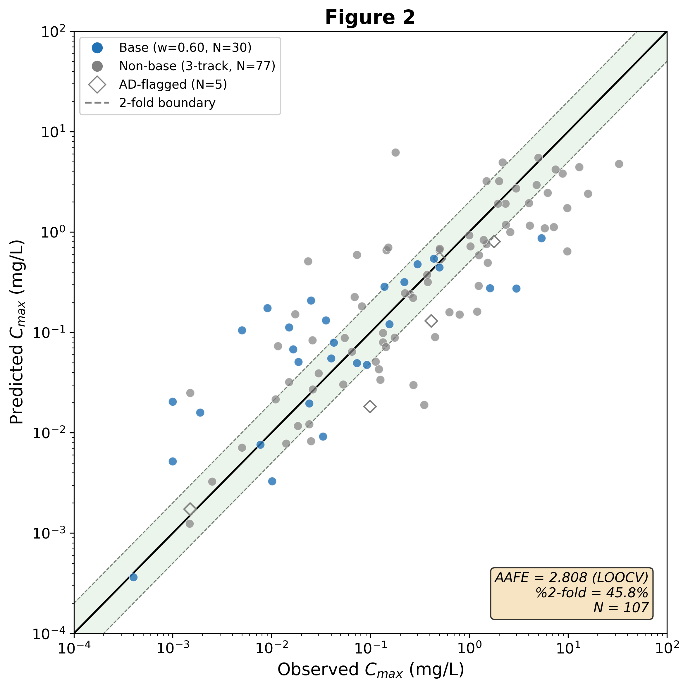

# Sisyphus

**Graph-based whole-body PBPK simulation with native uncertainty propagation**

Sisyphus is a physiologically based pharmacokinetic (PBPK) platform that represents
the human body as a typed directed multi-graph, derives ODE systems from graph
topology, and propagates parameter uncertainty through Monte Carlo sampling.

It accepts a SMILES string and dosing regimen, then produces PK endpoints such as
Cmax, Tmax, AUC, and half-life with prediction intervals. The platform also supports
multi-dose simulation, Bayesian therapeutic drug monitoring, model-informed
precision dosing, drug-drug interaction modeling, pharmacogenomic phenotype-aware
prediction, and PK/PD effect estimation.



## Quickstart

```bash
pip install -e ".[dev,ml,chem]"
sisyphus predict --smiles "Cn1c(=O)c2c(ncn2C)n(C)c1=O" --dose 100
```

## Project Links

- [Repository](https://github.com/jam-sudo/Sisyphus)
- [Full README](README.md)
- [Preprint PDF](Sisyphus_Preprint.pdf)
- [Reproducibility notes](docs/reproducibility.md)
- [SBI multi-drug results](docs/sbi_multi_drug_results.md)
- [Engine advantage analysis](docs/engine_advantage_analysis.md)

## Current Scope

Sisyphus is research software. It is intended for computational pharmacokinetics
experiments, model development, and reproducible method evaluation, not for direct
clinical decision-making.

